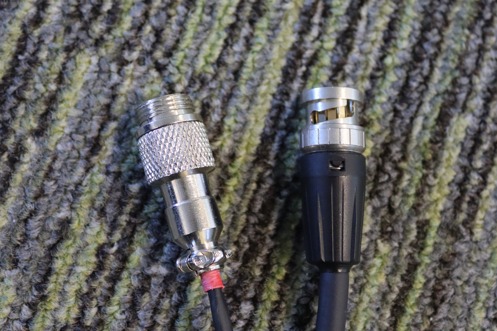
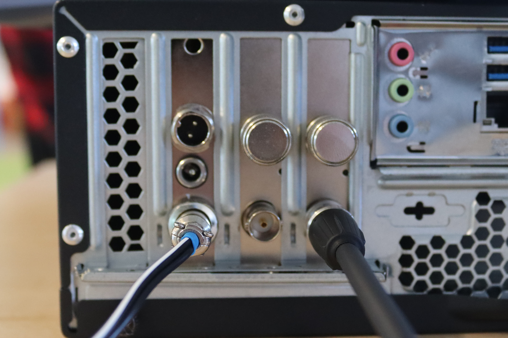
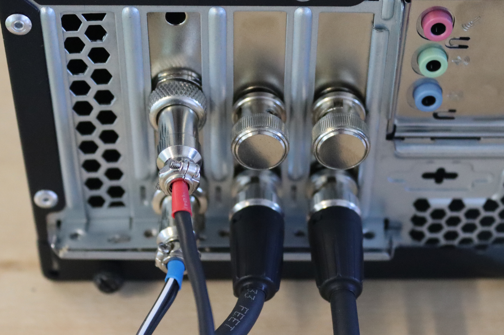
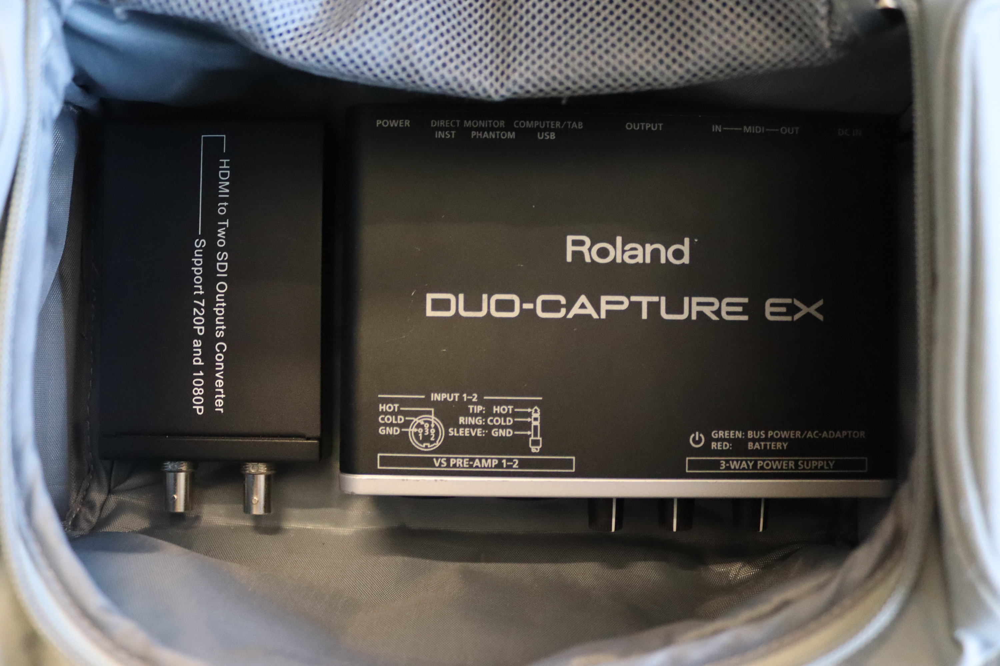
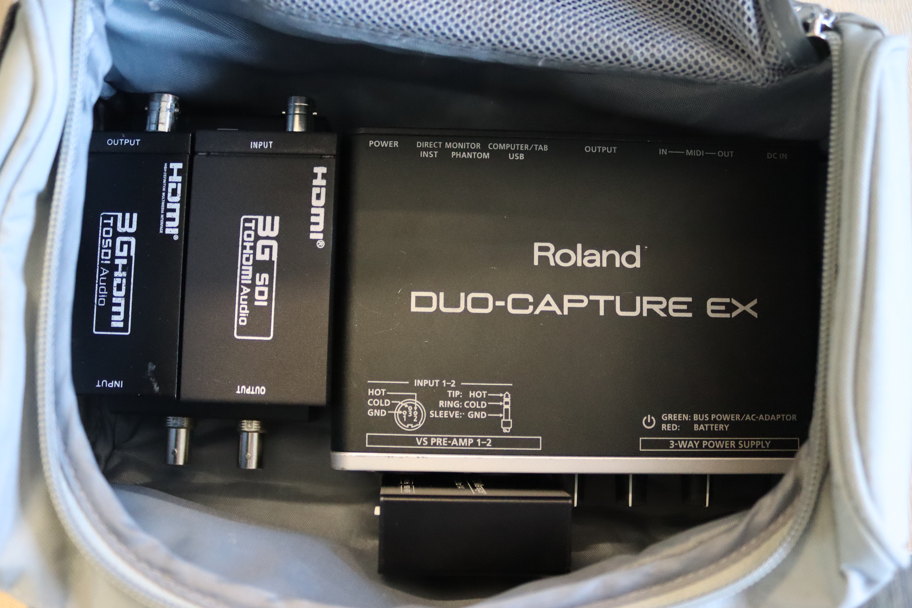

# Camera Rig Guide

_By_ [_Lyra_](../../../members/members/lyra.md)

## Introduction 
The rigs were originally build honorary society member [Cooper](https://bsky.app/profile/ministraitor.bsky.social), who maintains documentation on the [parts](https://administraitor.video/rig.html) and [operation](https://administraitor.video/rig_operation.html) of a filming rig. Cooper also maintains a page on the [assembly of a rig](https://administraitor.video/organizers/assembly.html), containing videos on some stages of the process.  This guide is designed to supplement his guide, based on the specific rig used by Hacksoc.

### Cables
Figure x - Male end of SDI cable.

Figure x - Female end of SDI cable.

## Camera Connections

## Podium Connections

## PC Connections
Moving to the PC, SDI cable running from the camera should be connected to the top/right (depending on PC orientation)  input.
Figure x - Connection of camera cables.

Figure x - All SDI & power cables connected.

## Troubleshooting

## Packing Everything Away

### Toilet Bag
The order parts are placed into the toilet bag is personal preference, however this guide describes the way I prefer to pack it.

The bag is essentially packed largest to smallest, with the first parts being the Roland DUO-CAPTURE EX and HDMI-SDI splitter. Places side-by-side, they fit nicely.
Figure x - First layer of the "toilet bag".

Figure x - Second layer of the "toilet bag".

