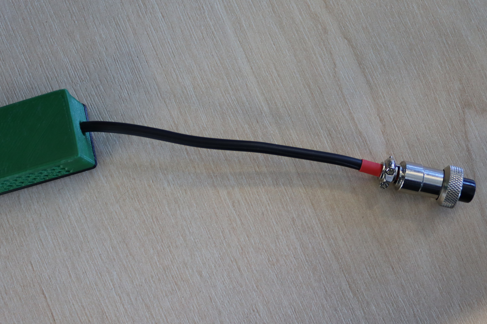
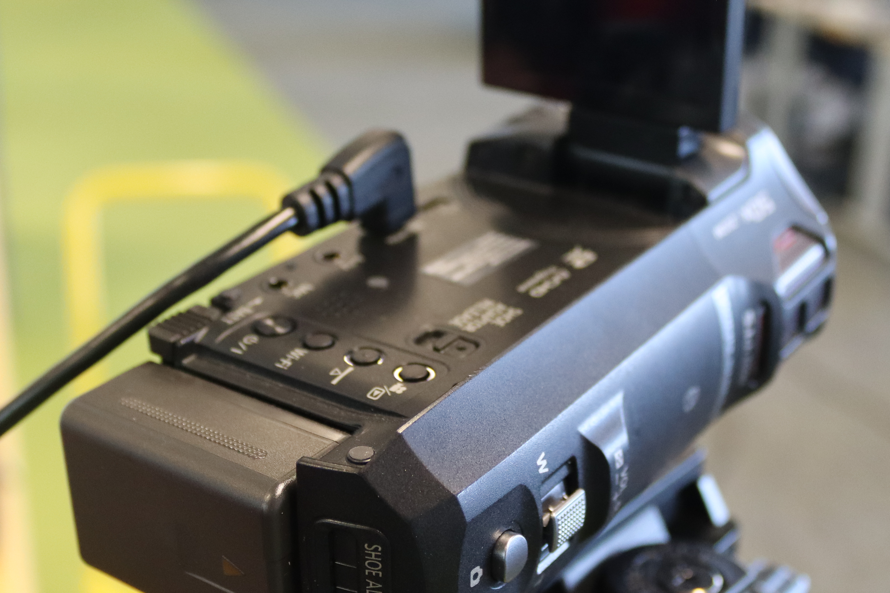
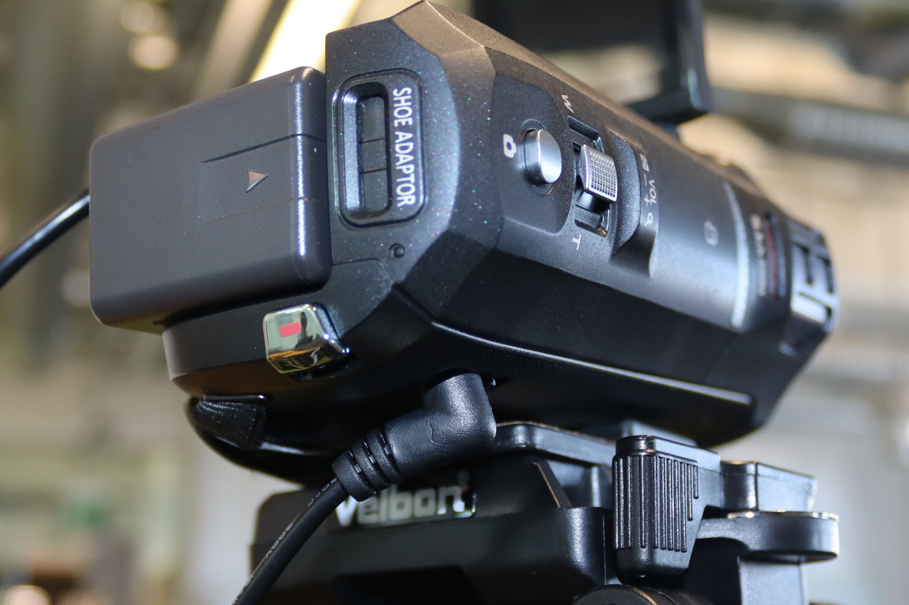
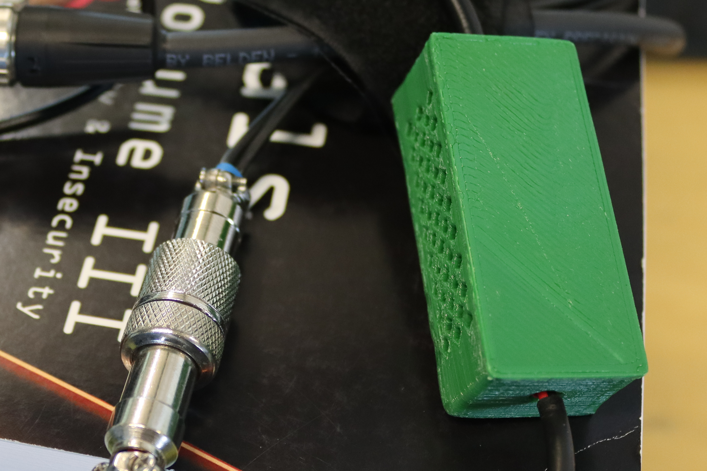
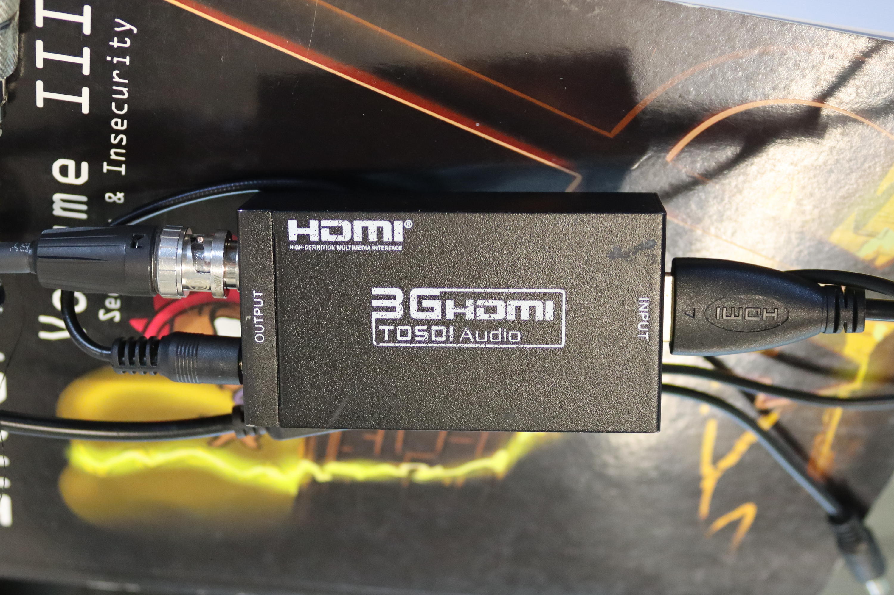
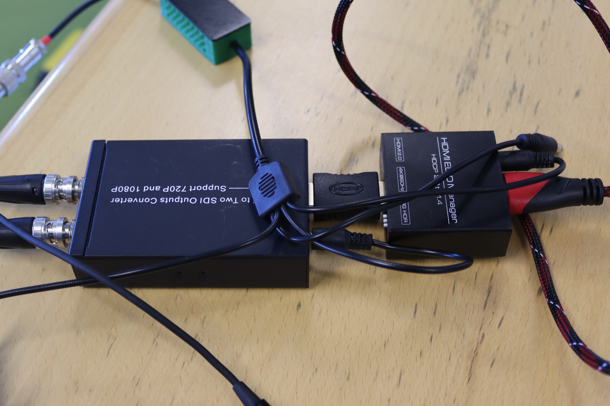
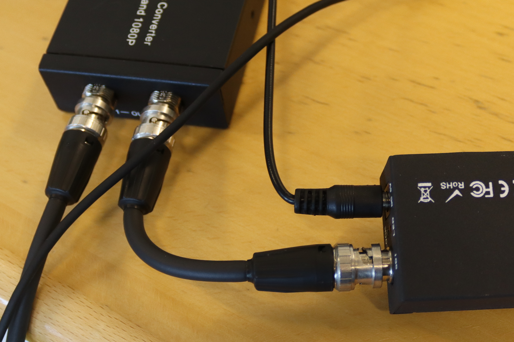
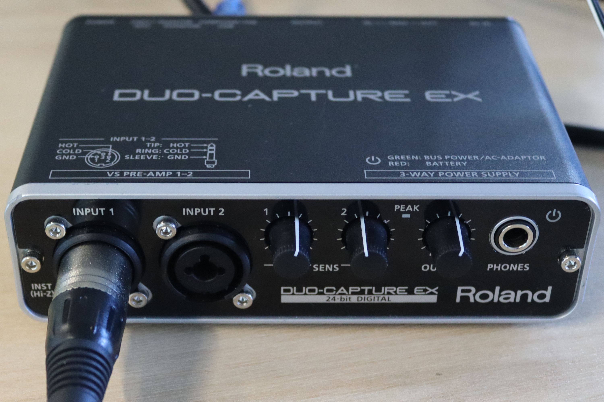
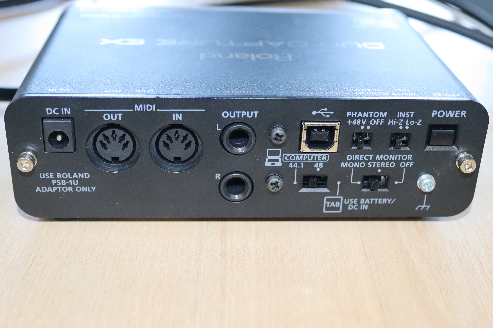

# Camera Rig Guide

_By_ [_Lyra_](../../../members/members/lyra.md)

## Introduction 
The rigs were originally designed and built by honorary society member [Cooper](https://bsky.app/profile/ministraitor.bsky.social), who maintains documentation on the [parts](https://administraitor.video/rig.html) and [operation](https://administraitor.video/rig_operation.html) of a filming rig. Cooper also maintains a page on the [assembly of a rig](https://administraitor.video/organizers/assembly.html), containing videos on some stages of the process.  This guide is designed to supplement his work, based on the specific rig used by Hacksoc.

### Cables
The filming rigs use Serial Digital Interface (SDI) cables, a standard designed for transmitting uncompressed video/audio, due to the increased reliability compared to High-Definition Multimedia Interface (HDMI) over long distances.

While SDI cables are bi-directional, the power cables attached makes them effectively mono-directional and getting them the wrong way round will result in you having to unplug everything and start again.

The male end of the SDI cable goes at the PC end.
Figure x - Male end of SDI cable.


The female end of the SDI cable goes to the camera/podium end.
Figure x - Female end of SDI cable.


Figure x - Power box connector.


## Camera Connections
Figure x - Camera HDMI output.


Figure x - Camera power supply.


Take one of the coloured power boxes, and connect it to the power cable tied to to SDI cable.
Figure x - Camera power box.


The HDMI cable from the camera should be to the HDMI-SDI converter. Pay particular attention to use the unit with `INPUT` above the HDMI port. The SDI cable and power supply should be connected to the other side.
```
Commmon mistake: Using the HDMI-SDI covnerter with `OUTPUT` above the HDMI port.
```

Figure x - HDMI to SDI conversion.


## Podium Connections
Figure x - HDMI to SDI conversion.


Figure x - HDMI to SDI conversion.


## PC Connections
Moving to the PC, SDI cable running from the camera should be connected to the top/right (depending on PC orientation)  input.
Figure x - Connection of camera cables.


The SDI cable from the podium should be connected to the bottom/left input. The orientation of the two power cables does not matter.
Figure x - All SDI & power cables connected.


## Audio
Figure x - Front of audio interface.


Figure x - Read of audio interface.


## Troubleshooting

## Packing Everything Away
Before anything is unplugged, the system should be powered off with a command such as `shutdown`

### Toilet Bag
The order parts are placed into the toilet bag is personal preference, however this guide describes the way I prefer to pack it.

The bag is essentially packed largest to smallest, with the first parts being the Roland DUO-CAPTURE EX and HDMI-SDI splitter. Places side-by-side, they fit nicely.
Figure x - First layer of the "toilet bag".


The ROLAND unit is quite tall, so the two HDMI-SDI converters sit rather well next to it, on top of the HDMI-SDI splitter.
Figure x - Second layer of the "toilet bag".


