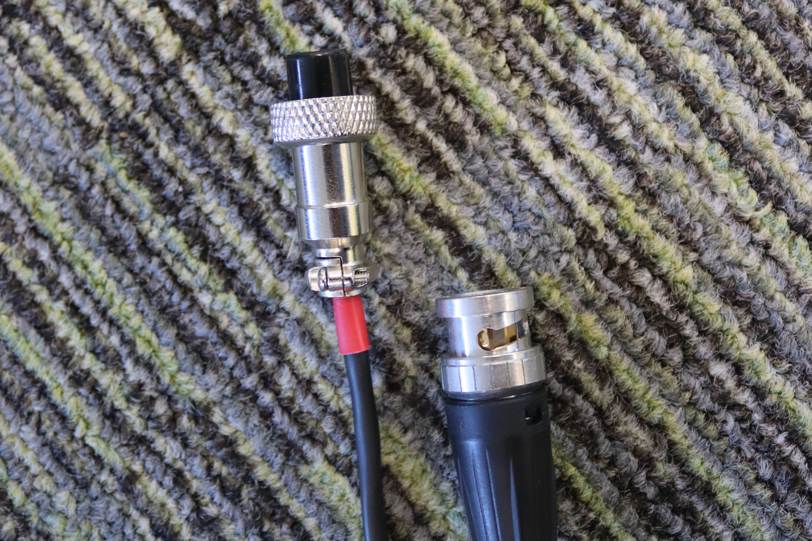

# Camera Rig Guide

_By_ [_Lyra_](../../../members/members/lyra.md)

## Introduction 
The rigs were originally build honorary society member [Cooper](https://bsky.app/profile/ministraitor.bsky.social), who maintains documentation on the [parts](https://administraitor.video/rig.html) and [operation](https://administraitor.video/rig_operation.html) of a filming rig. These pages do not cover the setup of a rig, so this guide is designed to supplement his resources.
### Cables

## Camera

## Podium

## Rig PC

## Packing Up

